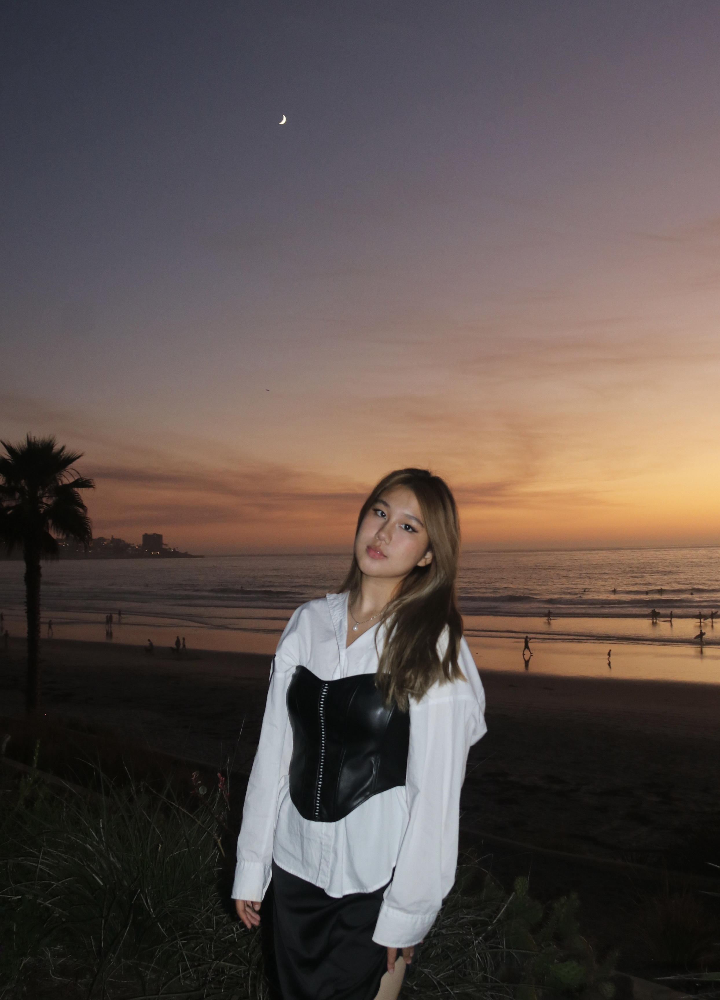

# Portfolio — Le Labo Inspired Design

A sophisticated, minimalist portfolio website inspired by Le Labo's refined aesthetic. Built with vanilla HTML, CSS, and JavaScript for maximum performance and simplicity.

## Philosophy

> "Perfection is achieved not when there is nothing more to add, but when there is nothing left to take away."

This portfolio embraces the principles of sophisticated minimalism—clean typography, thoughtful spacing, neutral color palettes, and understated elegance that lets your work speak for itself.

## Features

- **Minimalist Design**: Clean, sophisticated layout inspired by luxury brand aesthetics
- **Responsive**: Seamlessly adapts to all devices and screen sizes
- **Performance**: Vanilla JavaScript for fast loading and smooth interactions
- **Accessibility**: Semantic HTML and keyboard navigation support
- **Elegant Animations**: Subtle scroll-triggered animations and hover effects
- **Contact Form**: Functional form with validation and notifications

## Getting Started

### 1. Running Locally

**Option A: Python Server**
```bash
# Navigate to the portfolio directory
cd "Portfolio site"

# Start server
python3 -m http.server 8084
```

**Option B: Node.js**
```bash
# Install live-server globally
npm install -g live-server

# Start server
live-server --port=8080
```

**Option C: VS Code Live Server**
1. Install the "Live Server" extension
2. Right-click on `index.html`
3. Select "Open with Live Server"

Visit `http://localhost:8080` to view your portfolio.

### 2. Customization

#### Personal Information
Replace placeholder content in `index.html`:

```html
<!-- Update navigation logo -->
<a href="#home" class="nav-logo">YOUR NAME</a>

<!-- Update hero section -->
<h1 class="hero-title">
    Creative <span class="highlight">Developer</span>
</h1>

<!-- Update contact information -->
<p>hello@yourname.com</p>
<p>+1 (555) 123-4567</p>
<p>New York, NY</p>
```

#### Color Scheme
The current palette uses sophisticated neutrals. To customize, edit these CSS variables in `src/index.css`:

```css
/* Primary colors */
--background: #faf9f7;     /* Warm cream background */
--secondary-bg: #f5f4f1;   /* Light neutral sections */
--text-primary: #2c2c2c;   /* Deep charcoal text */
--text-secondary: #6b6b6b; /* Medium gray text */
--accent: #8b7355;         /* Warm brown accent */

/* Alternative sophisticated palettes */

/* Cool Minimalist */
--background: #f8f9fa;
--accent: #495057;

/* Warm Monochrome */
--background: #fefefe;
--accent: #6b5b73;

/* Modern Luxury */
--background: #fbfbfb;
--accent: #2d3748;
```

#### Projects
Update the projects section with your own work:

```html
<div class="project-card">
    <div class="project-image">
        <!-- Add your project image -->
        
    </div>
    <div class="project-content">
        <h3 class="project-title">Your Project Name</h3>
        <p class="project-description">
            Your project description that captures the essence and impact of your work.
        </p>
        <div class="project-tech">
            <span class="tech-tag">React</span>
            <span class="tech-tag">Node.js</span>
            <!-- Add your technologies -->
        </div>
        <div class="project-links">
            <a href="your-live-url" class="project-link">
                <i class="fas fa-external-link-alt"></i>
                Live Site
            </a>
            <a href="your-github-url" class="project-link">
                <i class="fab fa-github"></i>
                Code
            </a>
        </div>
    </div>
</div>
```

#### Skills
Customize the expertise section to reflect your skills:

```html
<div class="skill-category">
    <h3>Your Specialty</h3>
    <div class="skill-list">
        <span class="skill-item">Skill One</span>
        <span class="skill-item">Skill Two</span>
        <!-- Add your skills -->
    </div>
</div>
```

### 3. Adding Images

#### Project Images
1. Create an `images` folder in your portfolio directory
2. Add project images (recommended: 800x400px, optimized for web)
3. Update image paths in your HTML:

```html
<div class="project-image">
    
</div>
```

#### Profile Image
Replace the placeholder in the hero section:

```html
<div class="hero-image">
    
</div>
```

Add this CSS for the profile image:

```css
.profile-image {
    width: 300px;
    height: 300px;
    object-fit: cover;
    border: 1px solid rgba(44, 44, 44, 0.1);
}
```

### 4. Typography

The design uses system fonts for reliability and performance. To add custom fonts:

```html
<!-- Add to <head> section -->
<link href="https://fonts.googleapis.com/css2?family=Inter:wght@200;300;400;500&display=swap" rel="stylesheet">
```

```css
/* Update CSS */
body {
    font-family: 'Inter', 'Helvetica Neue', Arial, sans-serif;
}
```

### 5. Contact Form

The form currently shows notifications only. To add functionality:

1. **Email Service**: Use services like Formspree, Netlify Forms, or EmailJS
2. **Backend**: Connect to your own server endpoint
3. **Third-party**: Integrate with services like Typeform or Google Forms

Example with Formspree:

```html
<form class="contact-form" action="https://formspree.io/f/your-form-id" method="POST">
    <!-- Your form fields -->
</form>
```

## Deployment

### GitHub Pages
1. Push your code to a GitHub repository
2. Go to repository Settings → Pages
3. Select source branch (usually `main`)
4. Your site will be available at `username.github.io/repository-name`

### Netlify
1. Connect your GitHub repository to Netlify
2. Deploy automatically on every commit
3. Custom domain support available

### Vercel
1. Connect your repository to Vercel
2. Automatic deployments and optimizations
3. Excellent performance analytics

## Design Principles

This portfolio follows Le Labo's design philosophy:

- **Restraint**: Every element serves a purpose
- **Quality**: Thoughtful typography and spacing
- **Sophistication**: Understated elegance over flashy effects
- **Timelessness**: Classic design that won't feel dated
- **Craft**: Attention to detail in every interaction

## Browser Support

- Chrome/Edge 88+
- Firefox 85+
- Safari 14+
- Mobile browsers (iOS Safari, Chrome Mobile)

## License

This template is free to use for personal and commercial projects. Attribution appreciated but not required.

---

*Created with attention to craft and an appreciation for timeless design.* 